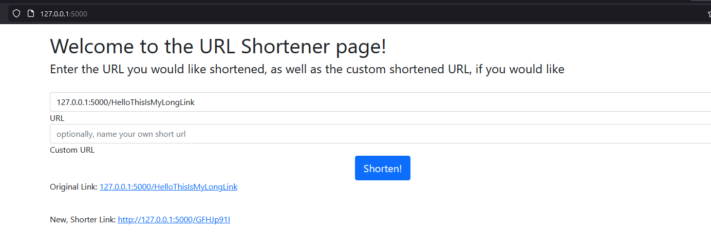
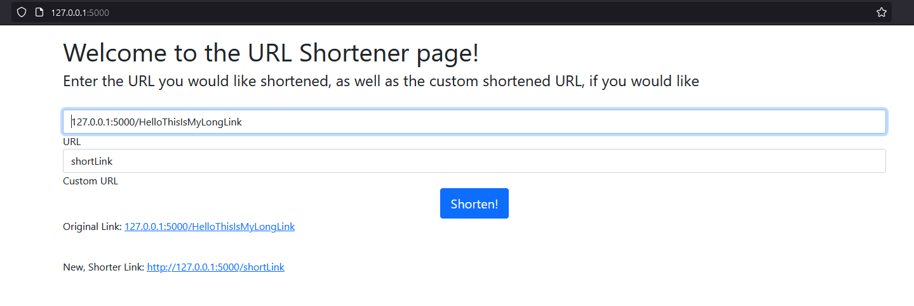

# Kyle's URL Shortener
#### Done as part of an interview for UnitedMasters.

This URL shortener was written by me, Kyle Ross. 
Done under the the prompt for a web-based application that will shorten URLs, but also that I not spend more than 2-3 hours on the project. 

---

### Implementation functionalities:
* Form box to enter a URL

* Returns the Original URL

* Form box to enter a potential custom id, if that is desired. 

### Future Implementation functionalities:
--* Finish the database entries. As is, entering the data into the DB is commented out, but I did not set up the server completely.
--* Check the use count of a specific URL, so users can monitor the use of a URL
--* Assess long-term stability of the character length. As it stands, it'll handle something like  62 ^ 8, or 2.18340105585e+14 entries. Is this enough?

### 
